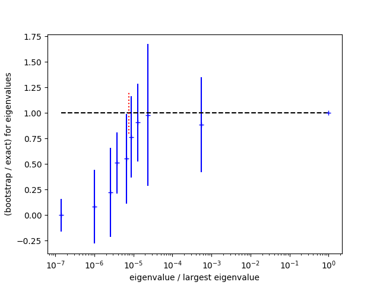

.. |GVar| replace:: :class:`gvar.GVar`

.. |~| unicode:: U+00A0
   :trim:

Case Study: Correlations and SVD Cuts
=====================================================
This case study illustrates a problem that arises when constructing
correlation matrices from a small number random samples. It shows how
to fix the problem using an SVD |~| cut.

The Problem
----------------
We want to determine the slope indicated by measurements of a
quantity ::

    y(x[i]) = y0 + s * x[i]

for ``x=[1,2...10]``. The
measurements are noisy so we average 15 sets ``y_sample[j]``
of independent measurements::

    import numpy as np
    import gvar as gv

    x = np.array([1., 2., 3., 4., 5., 6., 7., 8., 9., 10.])
    y_samples = [
        [2.8409,  4.8393,  6.8403,  8.8377, 10.8356, 12.8389, 14.8356, 16.8362, 18.8351, 20.8341],
        [2.8639,  4.8612,  6.8597,  8.8559, 10.8537, 12.8525, 14.8498, 16.8487, 18.8460, 20.8447],
        [3.1048,  5.1072,  7.1071,  9.1076, 11.1090, 13.1107, 15.1113, 17.1134, 19.1145, 21.1163],
        [3.0710,  5.0696,  7.0708,  9.0705, 11.0694, 13.0681, 15.0693, 17.0695, 19.0667, 21.0678],
        [3.0241,  5.0223,  7.0198,  9.0204, 11.0191, 13.0193, 15.0198, 17.0163, 19.0154, 21.0155],
        [2.9719,  4.9700,  6.9709,  8.9706, 10.9707, 12.9705, 14.9699, 16.9686, 18.9676, 20.9686],
        [3.0688,  5.0709,  7.0724,  9.0730, 11.0749, 13.0776, 15.0790, 17.0800, 19.0794, 21.0795],
        [3.1471,  5.1468,  7.1452,  9.1451, 11.1429, 13.1445, 15.1450, 17.1435, 19.1425, 21.1432],
        [3.0233,  5.0233,  7.0225,  9.0224, 11.0225, 13.0216, 15.0224, 17.0217, 19.0208, 21.0222],
        [2.8797,  4.8792,  6.8803,  8.8794, 10.8800, 12.8797, 14.8801, 16.8797, 18.8803, 20.8812],
        [3.0388,  5.0407,  7.0409,  9.0439, 11.0443, 13.0459, 15.0455, 17.0479, 19.0493, 21.0505],
        [3.1353,  5.1368,  7.1376,  9.1367, 11.1360, 13.1377, 15.1369, 17.1400, 19.1384, 21.1396],
        [3.0051,  5.0063,  7.0022,  9.0052, 11.0040, 13.0033, 15.0007, 16.9989, 18.9994, 20.9995],
        [3.0221,  5.0197,  7.0193,  9.0183, 11.0179, 13.0184, 15.0164, 17.0177, 19.0159, 21.0155],
        [3.0188,  5.0200,  7.0184,  9.0183, 11.0189, 13.0188, 15.0191, 17.0183, 19.0177, 21.0186],
        ]
    y = gv.dataset.avg_data(y_samples)

The result is an array of 10 |GVar|\s, ::

    >>> print(y)
    [3.014(23) 5.014(23) 7.014(23) 9.014(24) 11.013(24) 13.014(24) 15.013(24)
     17.013(24) 19.013(24) 21.013(24)]

that are highly correlated::

    >>> print(gv.evalcorr(y)[:4,:4])
    [[ 1.          0.9998438   0.99973225  0.99965233]
     [ 0.9998438   1.          0.99991873  0.99985194]
     [ 0.99973225  0.99991873  1.          0.99997514]
     [ 0.99965233  0.99985194  0.99997514  1.        ]]

To extract a slope we fit these data using the :mod:`lsqfit` module::

    import lsqfit

    def fcn(p):
        return p['y0'] + p['s'] * x

    prior = gv.gvar(dict(y0='0(5)', s='0(5)'))
    fit = lsqfit.nonlinear_fit(data=y, fcn=fcn, prior=prior)
    print(fit)

The fit, however, is very poor, with a ``chi**2`` per degree of freedom
of |~| 11::

    Least Square Fit:
      chi2/dof [dof] = 11 [10]    Q = 4.1e-19    logGBF = -1.7451

    Parameters:
                 y0     0.967 (11)      [  0.0 (5.0) ]
                  s   2.00079 (16)      [  0.0 (5.0) ]

    Settings:
      svdcut/n = 1e-12/0    tol = (1e-08*,1e-10,1e-10)    (itns/time = 5/0.0)

The problem is that we do not have enough samples in ``y_sample`` to determine
the correlation matrix sufficiently accurately. The smallest
eigenvalues of the correlation matrix tend to be underestimated with small
samples. Indeed the smallest eigenvalues go to zero when the sample size is
smaller than the dimension of ``y`` (i.e., 10 |~| here). The underestimated
eigenvalues result in contributions to the ``chi**2``
function in the fit that are both spurious and large.

A Poor Solution
----------------
One solution is to declare the correlations unreliable and to discard them,
keeping just the individual standard deviations::

    y = gv.gvar(gv.mean(y), gv.sdev(y))

    fit = lsqfit.nonlinear_fit(data=y, fcn=fcn, prior=prior)
    print(fit)

This gives an acceptable fit, ::

    Least Square Fit:
      chi2/dof [dof] = 0.02 [10]    Q = 1    logGBF = 14.067

    Parameters:
                 y0    1.014 (16)     [  0.0 (5.0) ]
                  s   1.9998 (26)     [  0.0 (5.0) ]

    Settings:
      svdcut/n = 1e-12/0    tol = (1e-08*,1e-10,1e-10)    (itns/time = 5/0.0)

but the very small ``chi**2`` confirms what we suspect: that we are ignoring
very strong correlations that are relevant to the fit.
Not surprisingly, the accuracy of our slope determination is quite
sensitive to these correlations.

A Better Solution
------------------
A better solution is to determine which of the correlation matrix's
eigenvalues are accurate and retain those in the fit. We do this
with :func:`gvar.dataset.svd_diagnosis` which uses a bootstrap
analysis to investigate the accuracy and stability of the eigenvalues.
Adding the code ::

    svd = gv.dataset.svd_diagnosis(y_samples)
    svd.plot_ratio(show=True)

displays a plot showing the ratio of the bootstrap estimate for each
eigenvalue divided by the real eigenvalue:

The bootstrap tests the stability of eigenvalues against changes in
the sample size (because it reduces the effective sample size).
Bootstrap estimates that are significantly lower than the real values
indicate eigenvalues that are likely unreliable. Here
bootstrap eigenvalues agree well with the real values for the
upper half of the spectrum, but are all low for the lower half.
The bootstrap errors
give a sense for how accurately the underlying eigenvalues are
determined given the sample size.

From the plot we see that the fitting problem lies with
the eigenvalues that are smaller than roughly 10\ :sup:`-5` |~| times
the largest
eigenvalue. To address this problem we introduce an SVD cut
using :func:`gvar.svd` with a value for ``svdcut`` suggested
by :func:`gvar.dataset.svd_diagnosis` (dotted red line in the figure)::

    y = gv.svd(y, svdcut=svd.svdcut)

    fit = lsqfit.nonlinear_fit(data=y, fcn=fcn, prior=prior)
    print(fit)

``gv.svd(y, svdcut=svd.svdcut)`` creates a new version of the
data ``y`` with a correlation matrix whose large eigenvalues are
unchanged but whose small eigenvalues, below ``svdcut*max_eig``,
are all set equal to ``svdcut*max_eig``
(where ``max_eig`` is the largest eigenvalue). This probably
overestimates the uncertainties associated with the small eigenvalues,
and so is a conservative move.
It makes the correlation matrix less singular, and fixes the fit::

    Least Square Fit:
      chi2/dof [dof] = 1.2 [10]    Q = 0.28    logGBF = 44.774

    Parameters:
                 y0     1.009 (19)      [  0.0 (5.0) ]
                  s   1.99998 (19)      [  0.0 (5.0) ]

    Settings:
      svdcut/n = 1e-12/0    tol = (1e-08*,1e-10,1e-10)    (itns/time = 5/0.0)

Our final estimate for the slope is ``s = 1.99998(19)``, whose uncertainty
is more than an order-of-magnitude smaller than what we obtained from
the uncorrelated fit.

This simple problem can be approached in different ways. For example,
we could estimate the slope from ``y[i+1] - y[i]``, doing a weighted
average over all values of |~| ``i``::

    slope = lsqfit.wavg(y[1:] - y[:-1])
    print(slope)

This again gives a slope of ``1.99998(19)`` provided an SVD cut has
first been applied to ``y``.

SVD cuts are often necessary when using correlation matrices constructed
from random samples. Typically large numbers of samples are needed to
calculate all of a correlation matrix's eigenvalues accurately ---
10--100 |~| times as many samples as there are variables, or more. Such large
numbers of samples are often not feasible, in which case an SVD cut might
be essential for a usable correlation matrix.
